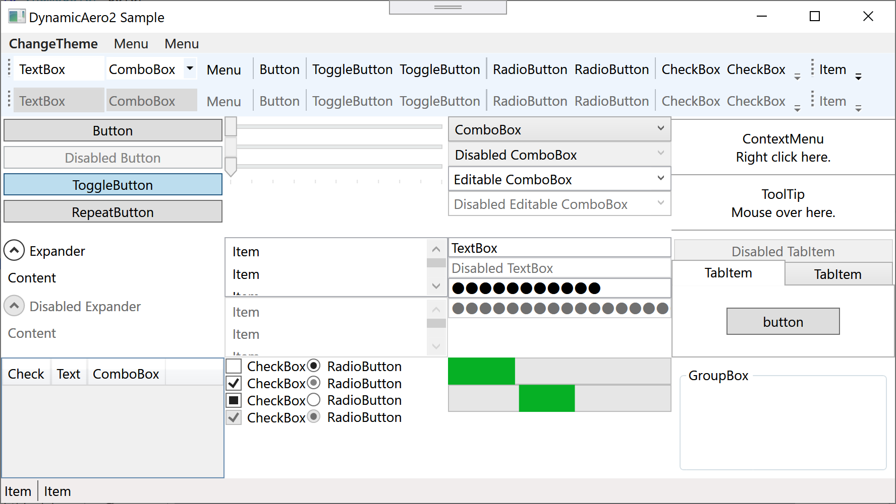
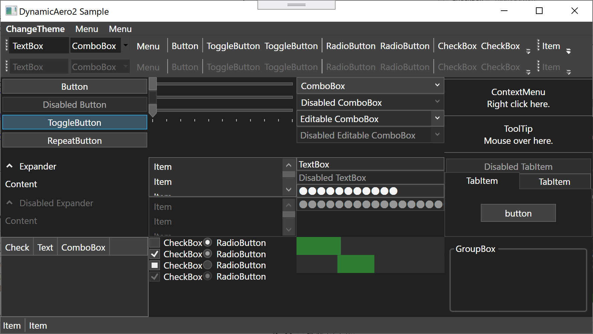
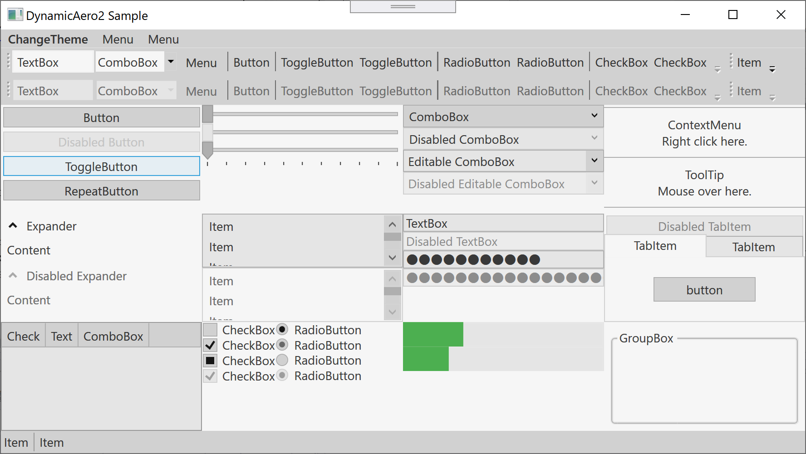

# DynamicAero2
DynamicAero2 theme is DynamicResource version of PresentationFramework.Aero2.

## Differences from PresentationFramework.Aero2
 - All Brush, Style, Template and Data are specified by DynamicResource.
 - You can change the color of the control without implementing Style.
```C#
<Window.Resources>
    <SolidColorBrush x:Key="ScrollBar.Static.Background" Color="Red" />
</Window.Resources>
```

## Theme
### NormalColor
Equivalent to PresentationFramework.Aero2.

### Dark

### Light


## How to use
After adding `DynamicAero2.dll` to project reference, edit `App.xaml` as follows.
```C#
<Application [...]
             xmlns:DynamicAero2="clr-namespace:DynamicAero2;assembly=DynamicAero2">
    <Application.Resources>
        <ResourceDictionary>
            <ResourceDictionary.MergedDictionaries>
                <DynamicAero2:Theme Color="NormalColor"/>
            </ResourceDictionary.MergedDictionaries>
        </ResourceDictionary>
    </Application.Resources>
</Application>
```
Change the `Color` property to `Dark` or `Light` if necessary.

## License
MIT license.

## Credits
Copyright (c) Manju Summoner

Theme styles and templates was converted based on [dotnet / wpf](https://github.com/dotnet/wpf/tree/master/src/Microsoft.DotNet.Wpf/src/Themes/XAML) repository.  
Copyright (c) .NET Foundation and Contributors.